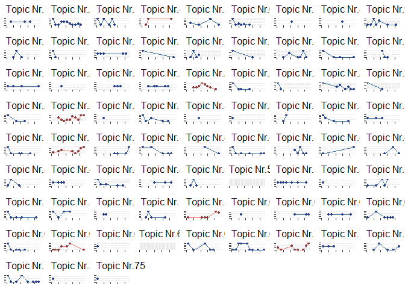

Goals and Approach
------------------

This project had the aim to apply different textual analytics techniques
and algorithms in order to identify a) emerging industries and b)
emerging technologies used in the aforementioned industries. The
approach can be simplified as follows:

1.  Preprocessing using regexpr

2.  Benchmarking different preprocessing assumptions

3.  Test and training set creation

4.  Corpus creation and boundary testing

5.  LDA training

6.  Identifying emerging topics by emergence analysis

7.  Using bigrams to identify specific complicated industries

Identification of Emerging Industries
-------------------------------------

LDA training with 75 topics and their assignment to the individual
companies by gamma, led to 7 emerging topics:

``` r
p1 <- "full"
p2 <- "nouns_adj"

# CREATING OVERVIEW TABLE
files  <- list.files(path = p1, recursive = T, full.names=F) %>% 
  as_tibble(.) %>% 
  mutate(p1 = paste0("/full/",value),
         p2 = paste0("/nouns_adj/",value)) %>% 
  separate(value, c("cik", "year", "month", "day"), "-") # separating column into multiple variables

length(unique(as.numeric(files$cik)))-length(unique(files$cik))
```

    ## [1] 0

``` r
# checking uniqueness of given numeric ciks vs. uniqueness of given character ciks
# no difference indicates no duplicates

files$day <- gsub(".txt", "", files$day)
files$date <- paste0(files$year, "-", files$month, "-", files$day) # create a date column 

files %<>% 
  mutate_at(c("month", "day"), as.numeric) %>% # transformation of columns using a compound assignment pipe operator (%<>%)
  mutate_at(c("year"), as.integer) %>% 
  mutate_at(c("date"), as.Date) %>% 
  arrange(date, cik) 


h1 <- hist(files$year) # analysis should only include 2008 and 2009
```


``` r
corpus <- DocumentTermMatrix(Corpus(VectorSource(c(1)))) # empty corpus
# CREATING CORPUSES

corpus.creation <- function () {
  nouns.adj <- vector()
  
  for (i in 1:nrow(files)) { # loading full data 
    nouns.adj[i] <- toString(readLines(paste0(getwd(),files[i,"p1"])))
  }
  
  nouns.adj %<>% gsub(".*Summary(.+?)Proceeds.*", "\\1",.) %>% 
    gsub("(\t.+?,)", "",.) %>% # only interested in letters
    gsub("[^A-Za-z/// ]+", "", .) %>% # only including letters from english alphabet
    gsub("\\s+", " ",.) %>% # widespaces
    gsub("\\t+", " ",.) # to many tab-breaks 
  
  corpus <<- DocumentTermMatrix(Corpus(VectorSource(nouns.adj)),
                                     control = list(removePunctuation = T, # to not consider noise made by punctuation
                                                    stopwords = T, # stopwords, as those do not have any specific connection to the industry
                                                    tolower = T, # to not differentiate between specific captions, important because of differenet use of language
                                                    removeNumbers = T, # noise 
                                                    stemming = F, # to keep technology-specific contexts of keywords 
                                                    # weighting = weightBin, 
                                                    wordLengths = c(3,25), # to be in norm with the lecture --> going up to 25 would also be a good alternative
                                                    bounds = list(global = c(15,100))))
  

}

corpus.creation()

# CREATING VECTOR OF COMPANIES AND CIKS THAT NEED TO BE DELETED IN MAIN FILE:

a <- c(seq(1:nrow(corpus))) # storing the rows to be deleted
b <- c(rep(NA,nrow(corpus))) # storing amount of terms per company

to.del <- data.frame(a,b)

for (i in 1:nrow(corpus)) {
  to.del[i,2] <- row_sums(corpus[i,]) # calculating amount of words
}

to.del <- to.del[to.del[,2] <= 10,] # deleting entries that do not fulfill minimum term amount requirement

# ADJUSTING THE CORPUS
corpus <- corpus[row_sums(corpus) > 10,] # exclude everything from the corpus with less than 10 words 

# TRAINING TOPIC MODEL 
topic <- LDA(corpus,  # document term matrix
             k = 75, # specifify number of topics
             method = "Gibbs", # staying with Gibbs instead of VEM to reduce possible local minima
             control = list(
               seed = 1234, # eases replication
               burnin = 25,  # how often sampled before estimation recorded
               iter = 50,  # number of iterations
               keep = 1,    # saves additional data per iteration (such as logLik)
               save = F,     # saves logLiklihood of all iterations
               verbose = 10  # report progress
             ))
```

    ## K = 75; V = 3921; M = 852
    ## Sampling 75 iterations!
    ## Iteration 10 ...
    ## Iteration 20 ...
    ## Iteration 30 ...
    ## Iteration 40 ...
    ## Iteration 50 ...
    ## Iteration 60 ...
    ## Iteration 70 ...
    ## Gibbs sampling completed!

``` r
# TOPIC INVESTIGATION
topic@loglikelihood             
```

    ## [1] -2078069

``` r
plot(topic@logLiks, type = "l") 
```


``` r
# TOPIC WORDS AND WORDCLOUD CREATION PER TOPIC 

topic.words <- function () {
  
  beta <- exp(topic@beta) # log of probability reported
  dim(beta)
  
  topic.terms <<- list() # empty list for topic words
  prob.top <<- list() # empty list for respective probabilities
  
  for (i in 1:topic@k) {
    
    topic.terms[[i]] <<- head(topic@terms[order(beta[i,], decreasing = T)], 30) # generating top words per topic
    prob.top[[i]] <<- head(sort(beta[i,], decreasing = T), 30)

  }
}

topic.words() # run wordcloud function


# ASSIGNING DOMINATING TOPICS PER COMPANY/CIK
gamma <- topic@gamma # creating the gamma overview for every company and the k topics
gamma %<>%  as.data.frame() %>%
  mutate(mak = do.call(pmax,.)) # maximizing the gamma values

colnames(gamma) <- c(seq(1:topic@k),"mak") 

gamma$topic <- as.numeric(colnames(gamma)[apply(gamma,1,which.max)]) # and deviating the topic for which gamma is maximized


# DELETING UNECESSARY ENTRIES
to.del <<- to.del[,-2] # delete columns counting the words per company in corpus
files <<- files[-to.del,] # deleting documents that had less than 10 terms from main file

files$topic <- gamma$topic # appending topic values
files$mak <- gamma$mak
files$id <- c(seq(1:nrow(files))) # creating ID for recreation 

files %<>% filter(mak > 0.25) 
h2 <- hist(files$year) # analysis should only include 2008 and 2009
```


``` r
# EMERGING TOPIC PLOT CREATION

topic.distribution <- files %>% # creating a sub-df i.o. to summarise per topic and year
  group_by(topic,year) %>% 
  mutate_at(c("year"),as.integer) %>% 
  count(topic) %>% 
  as.data.frame() 

files %>% 
  group_by(topic, year) %>% 
  mutate_at(c("year"), as.integer) %>% 
  count(topic)
```

    ## # A tibble: 298 x 3
    ## # Groups:   topic, year [298]
    ##    topic  year     n
    ##    <dbl> <int> <int>
    ##  1     1  2009     1
    ##  2     1  2014     1
    ##  3     1  2016     1
    ##  4     2  2008     5
    ##  5     2  2009     1
    ##  6     2  2010     1
    ##  7     2  2011     3
    ##  8     2  2012     3
    ##  9     2  2013     3
    ## 10     2  2014     2
    ## # ... with 288 more rows

``` r
w <- c(4,23,29,38,59,65,70) # LDA, 15-100 bound, k = 75 with mak

create.plots <- function() 
  {
  plot <- list() # storing all plots in one list to call them into the do.call
  
  for (i in 1:topic@k) {
    if (i %in% w) {
      plot[[i]] <- filter(topic.distribution, topic == i) %>% # filter per current topic
        ggplot(aes(x= year, y = n)) +
        geom_line(aes(colour = "royalblue4")) +
        geom_point(colour = "indianred4", size = 1) +
        ggtitle(paste0("Topic Nr.",i)) + 
        xlim(2008,2019) + # set x-axis to show years in focus
        theme(legend.position = "none", # deleting legends and axis titles
              plot.title = element_text(size = 12),
              axis.title.x = element_blank(),
              axis.text.x = element_blank(),
              axis.title.y = element_blank(),
              axis.text.y = element_blank())
    }
    else {
      plot[[i]] <- filter(topic.distribution, topic == i) %>% # filter per current topic
        ggplot(aes(x= year, y = n)) +
        geom_line(aes(colour = topic)) +
        geom_point(colour = "royalblue4", size = 1) +
        ggtitle(paste0("Topic Nr.",i)) + 
        xlim(2008,2019) + # set x-axis to show years in focus
        theme(legend.position = "none", # deleting legends and axis titles
              plot.title = element_text(size = 12),
              axis.title.x = element_blank(),
              axis.text.x = element_blank(),
              axis.title.y = element_blank(),
              axis.text.y = element_blank())
    }
  }
  do.call(grid.arrange, plot)
}
```

``` r
create.plots()
```



Including Plots
---------------

You can also embed plots, for example:


Note that the `echo = FALSE` parameter was added to the code chunk to
prevent printing of the R code that generated the plot.
